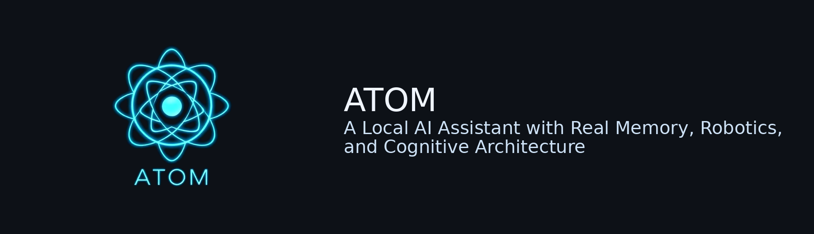
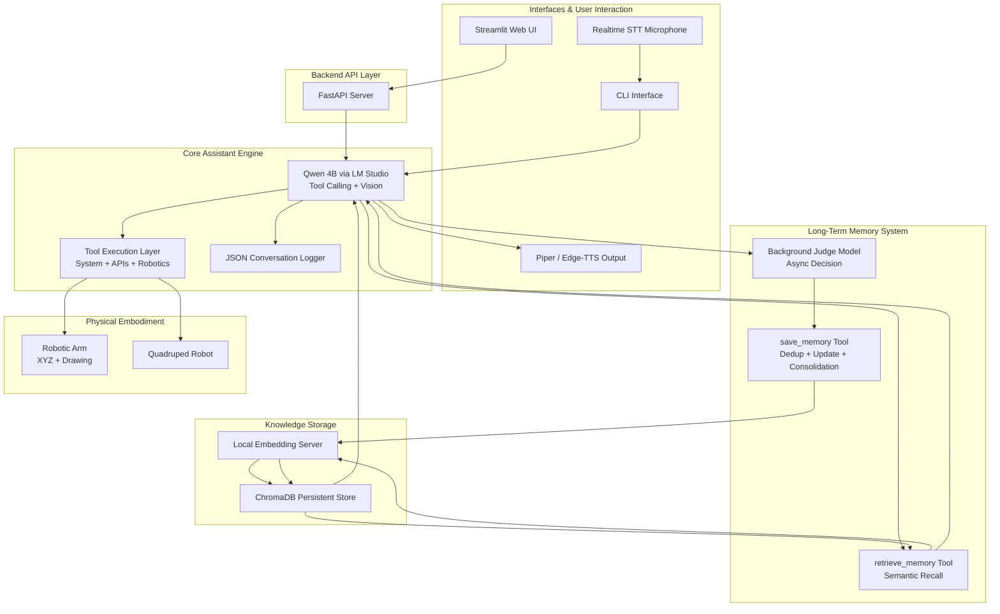

# 🧠 A.T.O.M
<p align="center">
  
</p>

<p align="center">
  <b>A.T.O.M — Local AI Assistant with Real Memory, Tools, and Robotics</b>
</p>

### **Autonomous Tool-Orchestrating Operation Machine**

*A Local AI Assistant with Real Memory, Robotics, and Cognitive Architecture*

---

## 🚀 Overview

**ATOM** is a **modular, local-first AI assistant** designed to behave less like a chatbot and more like an **operating system for intelligence**.
It supports **voice interaction**, **vision**, **physical robotics control**, **tool-based reasoning**, **semantic long-term memory**, and **autonomous background cognition** — all running locally.

Unlike cloud assistants, ATOM is built with:

* **Privacy by design** → everything runs locally
* **Reliability over gimmicks** → robust system engineering
* **Modularity & extensibility** → components can be swapped
* **Cognitive realism** → selective memory, async consolidation, and deliberate recall
* **Real-world embodiment** → controls physical robotic devices

ATOM is not a demo chatbot.
It’s a **personal AI system**.

## 🌍 Why ATOM Exists

* Cloud AI = privacy risk
* Humans need **local, reliable, embodied intelligence**
  
  ATOM exists to build that future.

# ✨ Core Capabilities

### 🎤 Speech & Interaction

* Real-time streaming speech recognition (RealtimeSTT)
* Configurable voice synthesis:

  * **Edge-TTS** *(toggle in config)*
  * fallback **Piper-TTS**
* CLI + Streamlit UI
* Tool calling with narration for human-like interaction

## 🔐 Privacy Note — Edge-TTS

ATOM supports two Text-to-Speech backends:

- **Edge-TTS** (default toggle)
- **Piper-TTS** (fully local)

⚠️ **Important Privacy Notice**

Edge-TTS sends text to Microsoft’s servers for synthesis.  
If you care about full local privacy, disable Edge-TTS in `config.yaml` and ATOM will automatically fall back to Piper, which is completely offline.


---

### 🧠 Local Language Model

* Runs entirely locally via **LM Studio**
* Currently powered by **Qwen3-VL-4B**
* Supports:

  * tool calling
  * structured reasoning
  * image understanding
* Model is swappable (Keep in mind to choose a Vision-Capable model)

---

### 🖼 Computer Vision

* Live camera capture
* Local inference
* Integrated tool: `capture_and_analyze_photo`

---

### 🤖 Physical Robotics Control

ATOM has **real embodiment**.

* Robotic arm integration

  * move to XYZ coordinates
  * draw shapes (including circles)
  * supports IK-based control
* Quadruped robot actions
* Robotic greetings and gestures

---

### 🧩 Tool System

ATOM includes a full tool orchestration layer.
It can reason, call tools, receive results, and continue thinking.

Includes utilities for:

* Smart home
* System monitoring
* File management
* Wikipedia / Web search
* Weather & geolocation
* Timers
* PDF creation
* and more…


# 🧠 Long-Term Memory System

ATOM features a **cognitive memory subsystem**, not just a log.
It stores what *matters*, retrieves intelligently, and manages itself in the background.

### ✅ Storage

* Persistent **ChromaDB**
* Structured factual memories
* Metadata:

  * type: project | goal | preference | skill | fact | concern
  * importance (1–5)
  * confidence
  * tags
* **Async memory saving**

  * handled by a smaller model
  * judges what to remember
  * rejects irrelevant information
  * zero latency impact

---

### 🔎 Retrieval & RAG-Style Injection

* Semantic similarity search
* Score-based filtering
* Relevance thresholds
* **Automatic memory injection every N turns (default = 10)**

This enables ATOM to:

* remember long-term goals
* recall personal preferences
* continue conversations weeks later
* avoid hallucinating memory

---

### ⚙️ Memory Tools (LLM Callable)

ATOM can explicitly **reason about memory when needed**, using on-demand tools:

#### `save_memory`

* deduplicates memories
* updates evolving information
* consolidates fragmented entries
* maintains a clean and meaningful memory base

#### `retrieve_memory`

* semantic recall
* importance & score filtering
* structured output

This gives ATOM **deliberate recall**, not just passive RAG.

---

### 🧠 Embedding System

* Dedicated **local embedding server**
* OpenAI-style API
* Can run on another machine to offload workload
* Makes memory scalable and portable


# 🔊 Logging & Debugging

* Full **JSON conversation logging**
* Debug middleware
* Token tracing
* Harness testing environment


# 🧪 Testing & Reliability

ATOM includes a **scenario testing harness**:

* predefined conversation scenarios
* reproducible test runs
* easy debugging workflow

Robust AI systems need validation.
ATOM has it.


## 🏗️ Architecture Overview



# 🛡️ Design Principles

* 🧠 **Cognitive realism** → AI that remembers *meaningfully*
* 🔒 **Privacy-first** → fully local execution
* ⚙️ **Modularity** → every subsystem swappable
* 🏗 **Engineering discipline** → async pipelines, validation, logging
* 🤖 **Real-world capability** → actually controls hardware
* ⚡ **Performance-aware** → GPU/CPU load balancing
* 🧪 **Testable** → harness + JSON logs

# 💻 Platform & Performance

Tested on:

**Laptop (everything except LLM):**

* Intel i5-1145G7
* Intel Iris Xe Graphics
* 16GB RAM

**Desktop (LLM host):**

* Ryzen 5 5600G @ 4.6 GHz
* GTX 1650
* 32GB RAM

Performance:

* ~24 tokens/sec
* 12k context
* GPU offload
* Stable long sessions

## 🖥️ Hardware Requirements

ATOM is designed to be practical on consumer hardware.

**Recommended**
- 16GB RAM+
- NVIDIA GPU for local LLM inference
- SSD storage

**Notes**
- Components can be split across machines (e.g., LLM on desktop, rest on laptop)
- Lightweight modes run on laptops without GPU
- Robotics + memory + STT/TTS can run independently of LLM host

# 📦 Installation

```bash
git clone https://github.com/AtifUsmani/A.T.O.M
cd A.T.O.M
conda create -n atom python=3.13
conda activate atom
pip install -r requirements.txt
```

<!-- Download [Vosk](https://alphacephei.com/vosk/models/vosk-model-small-en-us-0.15.zip) and extract it inside the [stt](./stt/) directory. -->

Configure:

```
example.yaml → config.yaml
template.txt → prompt.txt
```

Start:

```bash
python atom.py
```

Web/API Mode:

```bash
uvicorn api.server:app --reload
streamlit run frontend/main.py
```

Run `embedding_server.py` before ATOM.

```bash
python embedding/embedding_server.py
```

‼️ Make sure your SearXNG instance has JSON format enabled in the settings.

---

# 🎥 Demo

👉 [December Demo](https://youtu.be/EiwELGI6O9g)

---

# 🧩 Tech Stack

| Component  | Tech                          |
| ---------- | ----------------------------- |
| Speech     | [RealtimeSTT](https://github.com/KoljaB/RealtimeSTT)                   |
| LLM        | [LM Studio](https://lmstudio.ai/)                     |
| Model      | [Qwen3-VL-4B](https://lmstudio.ai/models/qwen3-vl)                   |
| Memory     | [ChromaDB](https://www.trychroma.com/)                      |
| Embeddings | [Custom local embedding server](./embedding/embedding_server.py) |
| UI         | [Streamlit](https://streamlit.io/)                     |
| API        | [FastAPI](https://fastapi.tiangolo.com/)                       |
| Web Search        | [SearXNG](https://github.com/searxng/searxng) / [DuckDuckGo](https://duckduckgo.com/)                       |
| Robotics   | [Python control layer](./robots/)          |
| Spider Bot   | [My Spider Bot Repo](https://github.com/AtifUsmani/Spider-bot)          |
| Robotic Arm   | Coming Soon 🔜          |
| PDF Creation   | [ReportLab](https://www.reportlab.com/)          |
| Weather   | [Open-Meteo API](https://open-meteo.com/)          |
| Home Automation   | [Home Assistant](https://www.home-assistant.io/)          |
| TTS        | [Edge-TTS](https://github.com/rany2/edge-tts) / [Piper](https://github.com/OHF-Voice/piper1-gpl)              |

## 🧪 Research Directions

ATOM is not just a project — it is a platform for exploring:

- **Long-term memory consolidation**
  - relevance scoring
  - semantic decay

- **Privacy-preserving personal AI**
  - local-only cognition
  - distributed personal compute nodes

- **Tool-centric cognitive planning**
  - deliberate reasoning loops
  - narration-aware tool execution

- **Embodied AI**
  - robotics grounding
  - physical task execution

- **Asynchronous cognition**
  - background thinking
  - delayed reasoning
  - memory consolidation pipelines